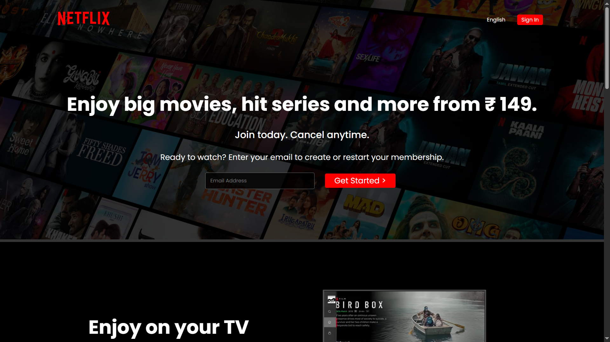
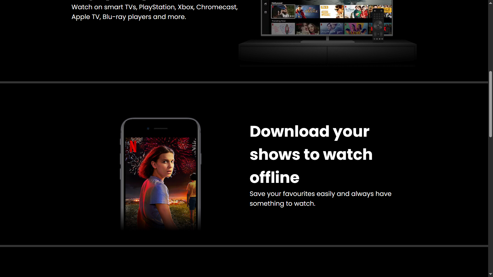
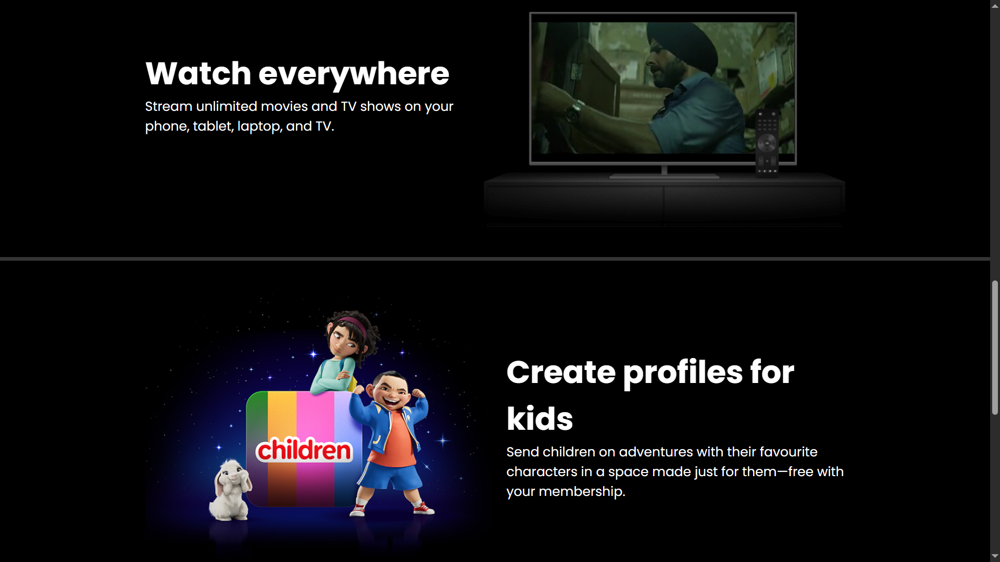
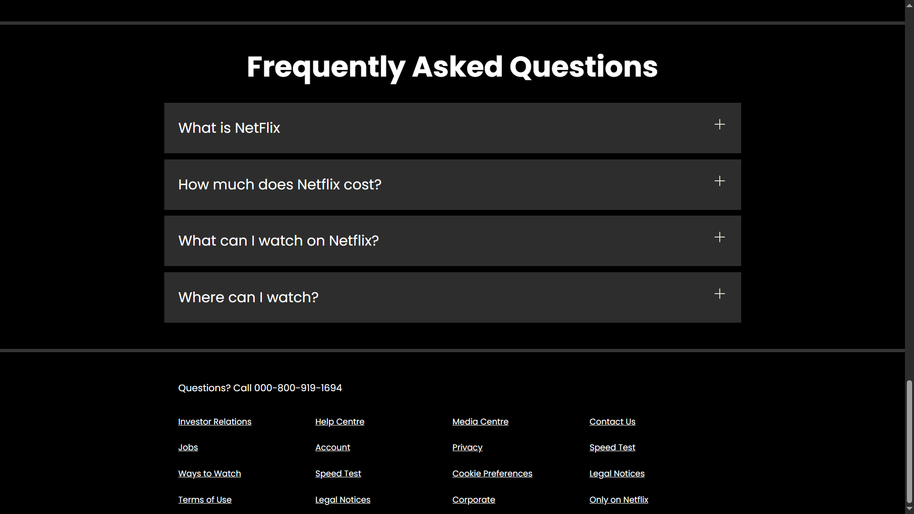

# 🎬 Netflix Clone (HTML + CSS)

This is a simple Netflix homepage clone created using only HTML and CSS. It is designed to closely resemble the original Netflix landing page, focusing purely on layout, design, and responsiveness without any JavaScript functionality.

## 🔍 Features

- ✅ Fully responsive layout
- 🎨 Modern Netflix-style UI
- 💻 Clean and structured code using semantic HTML and organized CSS

## 📸 Screenshot

  
 
 
 
*(Add your screenshot image to your repo and rename it to `screenshot.png` or update the name here.)*

## 🚀 Getting Started

To view the project:

1. Clone the repository  
   ```bash
   git clone https://github.com/mohammadammar9890/netflix-clone.git

2. Open index.html in your browser.

## 💡 What I Learned
   - Building modern UI with only HTML and CSS
   - Working with layout techniques like Flexbox and Grid
   - Styling and organizing a project from scratch

## 📌 Future Improvements
   - Add JavaScript for interactivity
   - Add animations or transitions
   - Make a full Netflix clone with login and video section using full-stack technologies

📧 Contact
📫 Email: ammar989098@gmail.com

